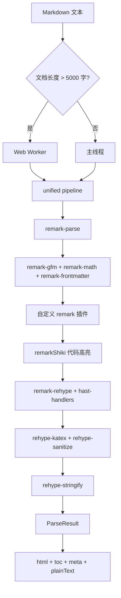

## 用户需求

对 GLM 生成的 `md-parser-core`、`md-parser-react`、`md-parser-vue` 和 `demo/` 代码进行全面重构，修复其架构偏离 OpenSpec 设计文档、实现 Bug、代码质量问题。

## 产品概述

Luhanxin Community Platform 的统一 Markdown 解析方案，包含三个包：

- `@luhanxin/md-parser-core`：基于 unified 生态的核心解析引擎，支持 GFM + 自定义语法 + AST 导出 + TOC 提取 + XSS 防护 + WASM Worker 架构
- `@luhanxin/md-parser-react`：基于 core 的 React 渲染组件库
- `@luhanxin/md-parser-vue`：基于 core 的 Vue 3 渲染组件库
- `demo/`：两个独立的 Demo 应用，用于验证包功能

## 核心问题

### P0 -- 架构级偏离 Spec

1. 包结构错误：Spec 要求 `packages/md-parser/` 内部 monorepo，实际是三个平铺在 `packages/` 下的独立包（此问题暂不做目录迁移，因当前三包已在 pnpm workspace 中正常工作，但需确保包名和依赖关系正确）
2. WASM Worker 架构完全缺失：Spec 的 Decision 2 是核心架构设计，`worker/` 目录完全不存在
3. Mermaid 渲染错误地放在 React/Vue 组件中：应该在 Core 的 Worker 中执行

### P1 -- 实现 Bug

4. 插件生成 `className` 而非 `class`：三个自定义语法插件在 HTML 中使用了 JSX 属性名
5. 插件设计冲突：自定义节点被提前转为 HTML，`render.ts` 中 `rehypeCustomNodes()` 成为死代码
6. Container 插件只能匹配单段落容器：多行内容解析失败
7. Vue `emit` 返回值误用：`const url = await emit(...)` -- Vue emit 不返回值
8. Vue `onMounted` 返回清理函数无效：应该用 `onUnmounted`
9. 双重解析浪费性能：`renderMarkdown` 内部已做 parse，`useMarkdown` 又单独调 `parseMarkdownToAst`
10. `extractMeta`/`extractToc` API 签名与 README 不匹配

### P2 -- 代码质量

11. React CSS Module 完全失效：组件用字符串 className 而非 module import
12. React MarkdownRenderer 塞了编辑器功能（图片上传/水印）：违反 Spec Non-goals
13. Vue MarkdownRenderer 458 行巨型组件：违反单一职责
14. 缺少 `ParseResult` 统一类型和 `useToc` 独立 hook/composable
15. Demo App 内联样式，不像企业级 demo
16. Vue scoped 样式没有嵌套结构，大量 `:deep()` 平铺
17. `sanitizeHtml` 手写正则与 rehype-sanitize 重复冗余

## 技术栈

- md-parser-core：TypeScript + unified (remark/rehype) + shiki + Web Worker API
- md-parser-react：React 18 + TypeScript + CSS Modules (.module.less)
- md-parser-vue：Vue 3 + TypeScript + scoped CSS
- 构建工具：tsup (core/react), vite lib mode (vue)
- 测试：vitest
- 代码规范：Biome

## 实现方案

### 1. 核心架构修复 -- 统一 ParseResult + Worker 架构

**方案**：在 core 中新增 `ParseResult` 统一类型，重构 `renderMarkdown` 一次解析返回全部结果（HTML + TOC + meta + plainText），消除双重解析。新增 `worker/` 目录实现 Web Worker 架构，将大文档解析和 Mermaid 渲染移入 Worker。

**关键决策**：

- `renderMarkdown()` 改为返回 `ParseResult` 而非单纯 string，一次 unified pipeline 完成所有提取
- Worker 通过 `WorkerRequest/WorkerResponse` 消息协议通信
- 文档 > 5000 字自动启用 Worker，Mermaid 始终在 Worker 中渲染
- Mermaid 渲染从 React/Vue 组件中移除，改为 core Worker 产出 SVG 字符串

### 2. 插件系统修复

**方案**：重构三个自定义语法插件，从「直接转 HTML 节点」改为「产出自定义 mdast 节点 + rehype handler 转换」。这修复了 className vs class 问题、rehypeCustomNodes 死代码问题，以及 container 多行内容问题。

**关键决策**：

- remark 插件只负责产出自定义 mdast 节点（MentionNode, HashtagNode, ContainerNode）
- 通过 `remark-rehype` 的 `handlers` 选项配置自定义节点到 hast 的转换
- Container 插件重写为基于 blockquote-like 的多行匹配逻辑

### 3. React 包修复

**方案**：移除图片上传/水印等编辑器功能（违反 Spec Non-goals），修复 CSS Module 引用使其实际生效，组件目录化，新增 `useToc` 独立 hook。样式文件从 `.module.css` 改为 `.module.less` 以对齐项目规范。

### 4. Vue 包修复

**方案**：拆分 458 行巨型 MarkdownRenderer 为职责明确的 composable + 轻量模板，修复 emit 返回值误用和 onMounted 清理问题，Vue scoped 样式改为嵌套结构。

### 5. Demo 改善

**方案**：移除内联样式，改用 CSS Module / scoped CSS，增加 TOC 侧边栏展示等功能验证。

## 实现备注

### 性能

- 消除双重解析是最关键的性能优化：当前 `useMarkdown` 中 `renderMarkdown` + `parseMarkdownToAst` 会对同一内容做两次完整 unified pipeline 处理
- Worker 架构中需注意 structured clone 的序列化开销，仅对大文档 (>5000 字) 启用
- Shiki 高亮在 `remarkShiki` 中使用 `Promise.all` 并发处理代码块，这个模式保留

### 向后兼容

- `renderMarkdown` 返回类型变更（string -> ParseResult）是破坏性变更，但包尚未发布，影响范围仅限 demo 和 react/vue 包
- 保留 `renderMarkdown` 的 options 参数签名，新增 `fullResult` option 控制是否返回完整结果

### 日志

- Worker 错误需要通过 `WorkerResponse.error` 传回主线程，不要在 Worker 内 console.error 后吞掉
- Mermaid 渲染超时/失败信息需传回调用方展示

## 架构设计

### 重构后 Core 包结构

```
packages/md-parser-core/src/
  index.ts                    # 统一导出
  core/
    index.ts
    parse.ts                  # parseMarkdownToAst
    render.ts                 # renderMarkdown -> ParseResult
    extract-toc.ts
    extract-text.ts
    extract-meta.ts
    highlight.ts              # Shiki 高亮
  plugins/
    index.ts
    remark-mention.ts         # 产出 MentionNode
    remark-hashtag.ts         # 产出 HashtagNode
    remark-container.ts       # 产出 ContainerNode
    hast-handlers.ts          # [NEW] 自定义节点 -> hast 的统一 handler
  types/
    index.ts
    ast.ts
    meta.ts
    toc.ts
    result.ts                 # [NEW] ParseResult
    worker.ts                 # [NEW] WorkerRequest/WorkerResponse
  worker/
    index.ts                  # [NEW] Worker 管理器 (WorkerPool/createWorker)
    worker-entry.ts           # [NEW] Worker 入口 (onmessage handler)
    parse-worker.ts           # [NEW] Worker 内的解析逻辑
    mermaid-worker.ts         # [NEW] Worker 内的 Mermaid 渲染
  sanitize/
    schema.ts                 # 移除冗余 sanitizeHtml
  __tests__/
    core.test.ts
    plugins.test.ts
    sanitize.test.ts
    worker.test.ts            # [NEW]
```

### 数据流



## 目录结构

```
packages/md-parser-core/
  src/
    types/result.ts              # [NEW] ParseResult 统一返回类型，包含 html/toc/meta/plainText 字段
    types/worker.ts              # [NEW] WorkerRequest/WorkerResponse 类型定义，Worker 消息协议
    plugins/remark-mention.ts    # [MODIFY] 重构为产出 MentionNode 而非直接转 HTML；修复 className -> class
    plugins/remark-hashtag.ts    # [MODIFY] 重构为产出 HashtagNode 而非直接转 HTML；修复 className -> class
    plugins/remark-container.ts  # [MODIFY] 重写为支持多行匹配的 ContainerNode 产出；修复 className -> class
    plugins/hast-handlers.ts     # [NEW] 自定义 mdast 节点到 hast 的统一 handler 映射
    plugins/index.ts             # [MODIFY] 更新导出
    core/render.ts               # [MODIFY] 一次 pipeline 返回 ParseResult；移除死代码 rehypeCustomNodes；通过 remark-rehype handlers 配置自定义节点转换
    core/parse.ts                # [MODIFY] 集成自定义插件
    core/extract-toc.ts          # [MODIFY] 在 render pipeline 中调用，不单独暴露需要 AST 的 API
    core/extract-meta.ts         # [MODIFY] 同上
    core/extract-text.ts         # [MODIFY] 同上
    core/index.ts                # [MODIFY] 更新导出
    worker/index.ts              # [NEW] WorkerManager 类，管理 Worker 生命周期，暴露 parseInWorker/renderMermaidInWorker
    worker/worker-entry.ts       # [NEW] Worker 线程入口，监听 message 分发到 parse/mermaid handler
    worker/parse-worker.ts       # [NEW] Worker 内的大文档解析逻辑
    worker/mermaid-worker.ts     # [NEW] Worker 内的 Mermaid SVG 渲染（动态 import mermaid）
    sanitize/schema.ts           # [MODIFY] 移除冗余的 sanitizeHtml 和 containsDangerousContent 函数
    index.ts                     # [MODIFY] 更新导出，新增 ParseResult/WorkerManager
    __tests__/core.test.ts       # [MODIFY] 适配 ParseResult 返回类型
    __tests__/plugins.test.ts    # [MODIFY] 适配插件重构
    __tests__/sanitize.test.ts   # [MODIFY] 移除 sanitizeHtml 相关测试
  tsup.config.ts                 # [MODIFY] 简化为单一配置，添加 worker entry
  package.json                   # [MODIFY] 添加 worker 导出

packages/md-parser-react/
  src/
    MarkdownRenderer/
      index.tsx                  # [MODIFY] 从 src/MarkdownRenderer.tsx 移入目录；移除图片上传/水印；修复 CSS Module
      markdownRenderer.module.less  # [NEW] 提取样式
    components/
      CodeBlock/
        index.tsx                # [MODIFY] 修复 CSS Module 引用
        codeBlock.module.less    # [NEW]
      CustomContainer/
        index.tsx                # [MODIFY] 修复 CSS Module 引用
        customContainer.module.less  # [NEW]
      MermaidDiagram/
        index.tsx                # [MODIFY] 改为调用 Core Worker 获取 SVG
        mermaidDiagram.module.less  # [NEW]
      Mention.tsx                # [MODIFY] 简单组件保持单文件
      Hashtag.tsx                # [MODIFY] 简单组件保持单文件
    hooks/
      useMarkdown.ts             # [MODIFY] 消除双重解析，使用 ParseResult
      useToc.ts                  # [NEW] 独立 TOC hook
    styles/
      markdown.module.less       # [MODIFY] 从 .css 改为 .less，修复全局样式部分
    index.ts                     # [MODIFY] 更新导出路径
  package.json                   # [MODIFY] 移除 mermaid peerDep
  tsup.config.ts                 # [MODIFY] 适配目录化组件

packages/md-parser-vue/
  src/
    MarkdownRenderer.vue         # [MODIFY] 移除图片上传/水印/addWatermark；修复 emit 返回值；修复 onMounted 清理；改用 useMarkdown composable；scoped 样式嵌套化
    components/
      MermaidDiagram.vue         # [MODIFY] 改为调用 Core Worker
      CodeBlock.vue              # [MODIFY] scoped 样式嵌套化
      CustomContainer.vue        # [MODIFY] scoped 样式嵌套化
      Mention.vue                # [MODIFY] 保持简单
      Hashtag.vue                # [MODIFY] 保持简单
    composables/
      useMarkdown.ts             # [MODIFY] 消除双重解析，使用 ParseResult；接受 string | Ref<string>
      useToc.ts                  # [NEW] 独立 TOC composable
    index.ts                     # [MODIFY] 更新导出

demo/react-app/
  src/
    App.tsx                      # [MODIFY] 移除内联样式，用 CSS Module；增加 TOC 侧边栏
    app.module.less              # [NEW] 应用样式
    main.tsx                     # [MODIFY] 适配

demo/vue-app/
  src/
    App.vue                      # [MODIFY] 改善 scoped 样式嵌套；增加 TOC 侧边栏
    main.ts                      # [MODIFY] 适配
```

## 关键代码结构

```typescript
// packages/md-parser-core/src/types/result.ts
export interface ParseResult {
  /** 渲染后的 HTML */
  html: string;
  /** 目录树 */
  toc: TocItem[];
  /** 文章元数据 */
  meta: ArticleMeta;
  /** 纯文本（用于搜索索引） */
  plainText: string;
}

// packages/md-parser-core/src/types/worker.ts
export interface WorkerRequest {
  id: string;
  type: 'parse' | 'mermaid';
  payload: Record<string, unknown>;
}

export interface WorkerResponse {
  id: string;
  type: 'parse' | 'mermaid';
  result?: unknown;
  error?: string;
}

// packages/md-parser-core/src/plugins/hast-handlers.ts
// remark-rehype 的 handlers 配置，将自定义 mdast 节点转为 hast
export const customHandlers: Record<string, Handler> = {
  mention: (state, node: MentionNode) => ({ /* ... */ }),
  hashtag: (state, node: HashtagNode) => ({ /* ... */ }),
  container: (state, node: ContainerNode) => ({ /* ... */ }),
};
```

## Agent Extensions

### Skill

- **openspec-apply-change**
- Purpose: 在实施过程中按照 OpenSpec change 的 tasks.md 逐步推进实施
- Expected outcome: 每个任务按照 spec 中定义的验收标准逐步完成

### Skill

- **openspec-verify-change**
- Purpose: 实施完成后验证代码是否符合 OpenSpec change 的 design.md 和 proposal.md
- Expected outcome: 确认重构后的代码与 spec 文档一致，无遗漏

### SubAgent

- **code-explorer**
- Purpose: 在实施过程中探索跨文件的引用关系和导入路径
- Expected outcome: 确保重构后的导入路径、导出声明全部正确