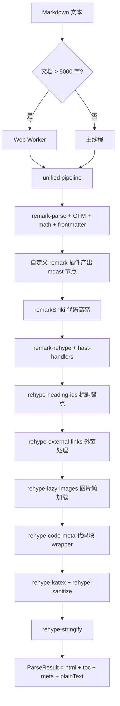
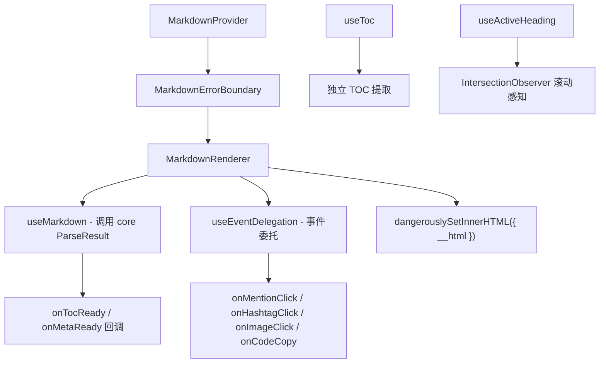

## 用户需求

对 GLM 生成的 `md-parser-core`、`md-parser-react`、`md-parser-vue` 和 `demo/` 代码进行全面重构，修复架构偏离 OpenSpec 设计文档的问题，修复所有实现 Bug，提升代码质量至企业级水准。同时补齐 GLM 完全遗漏的企业级交互能力：事件代理、滚动感知、标题锚点、渲染后处理、组件映射、全局 Provider、错误边界等。

## 产品概述

Luhanxin Community Platform 的统一 Markdown 解析渲染方案，三层架构：

- `@luhanxin/md-parser-core`：框架无关的解析引擎（unified 生态 + Worker + 插件系统 + rehype 渲染后处理）
- `@luhanxin/md-parser-react`：React 渲染组件库（事件代理 + 滚动感知 + Provider + 错误边界）
- `@luhanxin/md-parser-vue`：Vue 3 渲染组件库（事件代理 + 滚动感知 + provide/inject + 错误边界）
- `demo/`：两个完整的 Demo 应用，展示 TOC 侧边栏、事件回调、滚动高亮等企业级能力

## 核心问题 (GLM 遗留)

### P0 -- 架构级

1. WASM Worker 架构完全缺失（Spec Decision 2 核心设计）
2. Mermaid 渲染错误地放在 React/Vue 各自实现，违背"共享核心逻辑"设计
3. 缺少 ParseResult 统一类型，React/Vue 各自拼装返回值

### P1 -- 实现 Bug

4. 三个自定义语法插件在 HTML 字符串中使用 `className`（JSX 属性名）而非 `class`（HTML 属性名），样式全部失效
5. 插件将自定义节点提前转为 HTML 节点，render.ts 的 rehypeCustomNodes() 成为死代码
6. Container 插件只匹配单段落内的文本，多行内容解析失败
7. Vue `emit` 返回值误用：`const url = await emit(...)` -- Vue emit 不返回值
8. Vue `onMounted` 返回清理函数无效，应用 `onUnmounted`
9. `useMarkdown` 双重解析：renderMarkdown 内部已做完整 parse，又重复调 parseMarkdownToAst
10. `extractMeta`/`extractToc` API 签名与 README 文档不一致

### P2 -- 代码质量

11. React CSS Module 完全失效：组件用字符串 className 而非 module import
12. React MarkdownRenderer 塞了图片上传/水印功能，违反 Spec Non-goals（不做编辑器改造）
13. Vue MarkdownRenderer.vue 458 行巨型组件
14. Demo App 全部内联样式
15. sanitizeHtml 手写正则与 rehype-sanitize 功能重复

### P3 -- 企业级能力缺失（用户新增反馈）

16. 无事件代理：渲染后 DOM 中 @mention、#hashtag、图片、链接、代码复制按钮的点击无法捕获
17. 无标题锚点：TOC 提取了 id 但渲染的 h1-h6 没有 id 属性，页内跳转失效
18. 无滚动感知：无法追踪当前可视标题实现 TOC 高亮跟随
19. 无渲染后处理：外链无 target="_blank"、图片无懒加载、代码块无复制按钮 DOM 注入
20. 无组件映射：用户无法自定义 mention/codeBlock/image 的渲染组件
21. 无全局 Provider：多实例无法共享主题/事件配置
22. 无错误边界：Mermaid/Shiki 出错时整个组件 crash
23. 代码块只有独立组件，未与 dangerouslySetInnerHTML 渲染集成

## 技术栈

- md-parser-core: TypeScript + unified (remark/rehype) + shiki + Web Worker API
- md-parser-react: React 18 + TypeScript + CSS Modules (.module.less) + @apply Tailwind
- md-parser-vue: Vue 3 + TypeScript + scoped CSS (嵌套结构)
- 构建: tsup (core/react), vite lib mode (vue)
- 测试: vitest
- 代码规范: Biome

## 实现方案

### 1. 核心架构修复 -- 统一 ParseResult + 一次 pipeline

当前 `useMarkdown` 中先调 `renderMarkdown(content)` 再调 `parseMarkdownToAst(content)`，对同一内容做两次完整 unified pipeline，严重浪费性能。

**方案**: 重构 `renderMarkdown()` 返回 `ParseResult { html, toc, meta, plainText }`。在一次 unified pipeline 中，通过 remark 插件阶段在 AST 上提取 TOC/meta/plainText，然后继续 rehype 转换输出 HTML。React/Vue 的 `useMarkdown` 直接消费 `ParseResult`，不再重复解析。

### 2. 插件系统修复 -- mdast 节点 + hast-handlers

当前插件将自定义节点直接转为 HTML 字符串（且用了错误的 `className` 属性），同时 render.ts 里又有 `rehypeCustomNodes()` 处理同类节点 -- 两套逻辑冲突。

**方案**: remark 插件只负责产出自定义 mdast 节点（MentionNode, HashtagNode, ContainerNode）。通过 `remark-rehype` 的 `handlers` 选项注册 `hast-handlers.ts`，在 mdast->hast 转换阶段统一处理自定义节点到标准 hast 元素的映射。Container 插件重写为遍历相邻段落匹配 `:::` 开闭标记。

### 3. rehype 渲染后处理插件（企业级能力）

GLM 完全遗漏了渲染后处理。这些是 rehype 阶段的 hast 树变换插件，在 core 包中实现：

- **rehype-heading-ids**: 给 h1-h6 注入 id 属性和锚点链接 `<a class="heading-anchor" href="#id">#</a>`，使 TOC 跳转生效
- **rehype-external-links**: 外链自动添加 `target="_blank" rel="noopener noreferrer"`
- **rehype-lazy-images**: 图片添加 `loading="lazy"` 属性
- **rehype-code-meta**: 代码块外层注入 wrapper div（含语言标签 span + 复制按钮 button），使 dangerouslySetInnerHTML 渲染的代码块也能有复制功能

### 4. Worker 架构

新增 `worker/` 目录实现 Web Worker 架构。文档 > 5000 字时自动将解析移入 Worker，Mermaid 渲染始终在 Worker 中执行。Worker 通过 `WorkerRequest/WorkerResponse` 消息协议通信。

### 5. React 事件代理 + 滚动感知 + Provider + 错误边界

- **useEventDelegation**: 在 containerRef 上通过事件委托捕获 `a.mention[data-username]`、`a.hashtag[data-tag]`、`img`、`a[href]`、`button.copy-code` 的 click 事件
- **useActiveHeading**: 通过 IntersectionObserver 监听所有 `[id]` 标题元素的可见性，返回当前 activeId
- **MarkdownProvider**: React Context 提供全局主题/事件/组件覆盖配置
- **MarkdownErrorBoundary**: 专用错误边界，Mermaid/Shiki 出错时显示 fallback 而非整个组件 crash

### 6. Vue 对等能力

- **useEventDelegation composable**: 与 React 版对等的事件委托
- **useActiveHeading composable**: IntersectionObserver 滚动感知
- **provide/inject MarkdownProvider**: `useMarkdownProvider()` + `useMarkdownContext()`

### 7. CSS Module 修复 + 组件目录化

React 组件按项目规范目录化（有样式的组件变成 `ComponentName/index.tsx + componentName.module.less`），所有 className 通过 `styles.xxx` 引用。Vue 组件 scoped 样式改为嵌套结构。

## 实现备注

### 性能

- 消除双重解析是最大的性能优化点：当前两次 unified pipeline 的开销约 100-200ms（1w 字文档）
- rehype 渲染后处理插件（heading-ids, external-links, lazy-images, code-meta）都是单次 visit 遍历，开销 < 5ms
- useActiveHeading 使用 IntersectionObserver 而非 scroll 事件监听，不会造成主线程负载
- useEventDelegation 使用单一 click listener 委托，不会给每个 mention/hashtag 绑定独立事件

### 向后兼容

- `renderMarkdown` 返回类型从 `string` 变为 `ParseResult` 是破坏性变更，但包尚未发布（0.1.0），影响范围仅 demo 和 react/vue 包内部
- 保留 `renderMarkdownToHtml(input, options): Promise<string>` 便利方法，返回纯 HTML 字符串

### 错误处理

- Worker 错误通过 `WorkerResponse.error` 传回主线程并 reject Promise
- Mermaid 渲染超时（5s）后返回错误状态而非阻塞
- React MarkdownErrorBoundary 遵循已有 `apps/main/src/components/ErrorBoundary.tsx` 的模式

## 架构设计

### 数据流



### React 渲染架构



## 目录结构

### packages/md-parser-core/

```
src/
  index.ts                              # [MODIFY] 更新导出，新增 ParseResult/Worker
  core/
    index.ts                            # [MODIFY] 更新导出
    parse.ts                            # [MODIFY] 集成自定义插件到解析流程
    render.ts                           # [MODIFY] 一次 pipeline 返回 ParseResult；移除 rehypeCustomNodes 死代码；集成 hast-handlers 和渲染后处理插件
    extract-toc.ts                      # [MODIFY] 改为 remark 插件形式，在 pipeline 中提取 TOC
    extract-text.ts                     # [MODIFY] 同上
    extract-meta.ts                     # [MODIFY] 同上
    highlight.ts                        # [KEEP] Shiki 高亮保持不变
  plugins/
    index.ts                            # [MODIFY] 更新导出
    remark-mention.ts                   # [MODIFY] 重构：只产出 MentionNode mdast 节点，不转 HTML
    remark-hashtag.ts                   # [MODIFY] 重构：只产出 HashtagNode mdast 节点，不转 HTML
    remark-container.ts                 # [MODIFY] 重写：遍历相邻段落匹配 ::: 开闭标记，产出 ContainerNode
    hast-handlers.ts                    # [NEW] remark-rehype handlers，MentionNode/HashtagNode/ContainerNode -> hast element
    rehype-heading-ids.ts               # [NEW] h1-h6 注入 id 属性 + 锚点 <a>
    rehype-external-links.ts            # [NEW] 外链 target="_blank" + rel="noopener noreferrer"
    rehype-lazy-images.ts               # [NEW] 图片 loading="lazy"
    rehype-code-meta.ts                 # [NEW] 代码块注入 wrapper div + 语言标签 + 复制按钮 DOM
  types/
    index.ts                            # [MODIFY] 更新导出
    ast.ts                              # [KEEP]
    meta.ts                             # [KEEP]
    toc.ts                              # [KEEP]
    result.ts                           # [NEW] ParseResult 统一返回类型
    worker.ts                           # [NEW] WorkerRequest/WorkerResponse 消息协议
    events.ts                           # [NEW] EventHandlers 事件回调类型 (框架无关)
  worker/
    index.ts                            # [NEW] WorkerManager 管理生命周期，暴露 parseInWorker()
    worker-entry.ts                     # [NEW] Worker 线程入口 onmessage handler
    parse-worker.ts                     # [NEW] Worker 内解析逻辑
    mermaid-worker.ts                   # [NEW] Worker 内 Mermaid SVG 渲染
  sanitize/
    schema.ts                           # [MODIFY] 移除冗余的 sanitizeHtml/containsDangerousContent
  __tests__/
    core.test.ts                        # [MODIFY] 适配 ParseResult
    plugins.test.ts                     # [MODIFY] 适配插件重构
    sanitize.test.ts                    # [MODIFY] 移除冗余函数测试
    rehype-plugins.test.ts              # [NEW] 渲染后处理插件测试
```

### packages/md-parser-react/

```
src/
  index.ts                              # [MODIFY] 更新导出路径
  context/
    MarkdownProvider.tsx                # [NEW] React Context 提供全局主题/事件/组件覆盖
  MarkdownRenderer/
    index.tsx                           # [MODIFY] 移除图片上传/水印；集成事件代理；接受 Provider 配置
    markdownRenderer.module.less        # [NEW] 组件样式
  components/
    MarkdownErrorBoundary.tsx           # [NEW] Markdown 专用错误边界 (参考已有 ErrorBoundary 模式)
    CodeBlock/
      index.tsx                         # [MODIFY] 修复 CSS Module 引用
      codeBlock.module.less             # [NEW]
    CustomContainer/
      index.tsx                         # [MODIFY] 修复 CSS Module 引用
      customContainer.module.less       # [NEW]
    MermaidDiagram/
      index.tsx                         # [MODIFY] 改为调用 Core Worker 获取 SVG
      mermaidDiagram.module.less        # [NEW]
    Mention.tsx                         # [MODIFY] 简单组件保持单文件
    Hashtag.tsx                         # [MODIFY] 简单组件保持单文件
  hooks/
    useMarkdown.ts                      # [MODIFY] 消除双重解析，使用 ParseResult
    useToc.ts                           # [NEW] 独立 TOC hook
    useActiveHeading.ts                 # [NEW] IntersectionObserver 滚动感知
    useEventDelegation.ts               # [NEW] 事件委托 hook
  styles/
    markdown.module.less                # [MODIFY] 从 .css 改为 .less
```

### packages/md-parser-vue/

```
src/
  index.ts                              # [MODIFY] 更新导出
  context/
    MarkdownProvider.ts                 # [NEW] provide/inject 全局 Provider
  MarkdownRenderer.vue                  # [MODIFY] 移除图片上传/水印/addWatermark；修复 emit 返回值；修复 onMounted 清理；集成 useMarkdown composable 和事件代理
  components/
    MermaidDiagram.vue                  # [MODIFY] 改为调用 Core Worker
    CodeBlock.vue                       # [MODIFY] scoped 样式嵌套化
    CustomContainer.vue                 # [MODIFY] scoped 样式嵌套化
    Mention.vue                         # [KEEP]
    Hashtag.vue                         # [KEEP]
  composables/
    useMarkdown.ts                      # [MODIFY] 消除双重解析，使用 ParseResult；接受 string | Ref<string>
    useToc.ts                           # [NEW] 独立 TOC composable
    useActiveHeading.ts                 # [NEW] IntersectionObserver 滚动感知
    useEventDelegation.ts               # [NEW] 事件委托 composable
```

### demo/

```
react-app/
  src/
    App.tsx                             # [MODIFY] 移除内联样式；增加 TOC 侧边栏 + 滚动高亮 + 事件回调展示
    app.module.less                     # [NEW]
    main.tsx                            # [MODIFY] 适配

vue-app/
  src/
    App.vue                             # [MODIFY] 增加 TOC 侧边栏 + 滚动高亮 + 事件回调展示
    main.ts                             # [MODIFY] 适配
```

## 关键代码结构

```typescript
// packages/md-parser-core/src/types/result.ts
export interface ParseResult {
  html: string;
  toc: TocItem[];
  meta: ArticleMeta;
  plainText: string;
}

// packages/md-parser-core/src/types/events.ts
export interface EventHandlers {
  onMentionClick?: (username: string) => void;
  onHashtagClick?: (tag: string) => void;
  onImageClick?: (src: string, alt: string) => void;
  onLinkClick?: (href: string) => void;
  onCodeCopy?: (code: string, language: string) => void;
  onHeadingClick?: (id: string, level: number) => void;
}

// packages/md-parser-core/src/plugins/hast-handlers.ts
export const customHandlers: Record<string, Handler> = {
  mention: (state, node: MentionNode) => ({
    type: 'element', tagName: 'a',
    properties: { href: `/user/${node.username}`, className: ['mention'], dataUsername: node.username },
    children: [{ type: 'text', value: `@${node.username}` }],
  }),
  hashtag: (state, node: HashtagNode) => ({ /* ... */ }),
  container: (state, node: ContainerNode) => ({ /* ... */ }),
};
```

## Agent Extensions

### Skill

- **openspec-apply-change**
- Purpose: 在实施过程中按照 OpenSpec change 的 tasks.md 逐步推进，确保每一步符合 spec 验收标准
- Expected outcome: 实现代码与 design.md 一致，不遗漏 spec 中定义的能力

### Skill

- **openspec-verify-change**
- Purpose: 全部重构完成后验证实现是否覆盖 proposal.md 中列出的所有 Capabilities
- Expected outcome: 确认 ParseResult/Worker/插件/事件代理/滚动感知/Provider 等全部能力就绪

### SubAgent

- **code-explorer**
- Purpose: 在实施过程中探索跨文件的引用关系，确保重构后的导入路径和导出声明完整正确
- Expected outcome: 避免循环依赖、遗漏导出、路径错误等问题