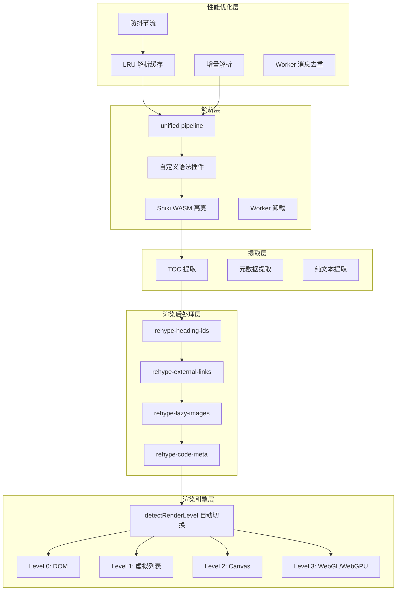
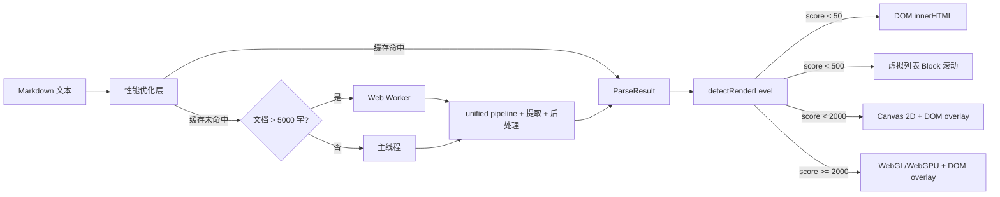
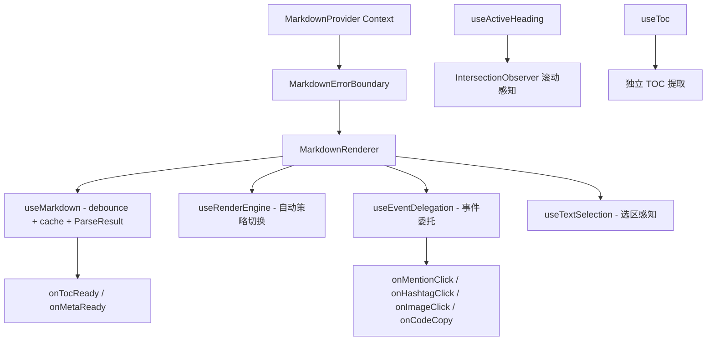

## 用户需求

对 GLM 生成的 `packages/md-parser-core`、`packages/md-parser-react`、`packages/md-parser-vue` 和 `demo/` 进行全面重构，覆盖以下四个层面：

## 产品概述

Luhanxin Community Platform 的统一 Markdown 解析渲染方案，五层企业级架构。

## 核心特性

### 修复 GLM 遗留问题

- 修复三个自定义语法插件的 className/class Bug 和插件设计冲突（死代码 rehypeCustomNodes）
- 修复 Container 插件多行内容解析失败
- 修复 Vue emit 返回值误用和 onMounted 清理 Bug
- 消除双重解析（renderMarkdown + parseMarkdownToAst），统一为 ParseResult 一次 pipeline 完成
- 实现 Spec Decision 2 的 Worker 架构（Shiki/Mermaid WASM 在 Worker 中执行）
- 移除违反 Spec Non-goals 的图片上传/水印编辑器功能
- React CSS Module 修复 + 组件目录化，Vue 巨型组件拆分 + scoped 嵌套化

### 企业级交互能力

- 事件代理系统：@mention / #hashtag / 图片 / 链接 / 代码复制的点击捕获
- 标题锚点注入：h1-h6 注入 id + 锚点链接，TOC 页内跳转生效
- 滚动感知：IntersectionObserver 追踪当前可视标题，TOC 高亮跟随
- 渲染后处理：外链 target="_blank"、图片懒加载、代码块复制按钮 DOM 注入
- 组件映射系统：用户可自定义 mention/codeBlock/image 的渲染组件
- 全局 Provider：React Context / Vue provide-inject 统一主题/事件/组件配置
- 错误边界：Mermaid/Shiki 出错时 fallback 而非整组件 crash
- 只读选区感知：选中文字可获取对应内容用于引用回复

### 渲染引擎分级架构

- Level 0 DOM：小文档 dangerouslySetInnerHTML / v-html
- Level 1 DOM + 虚拟列表：中等文档 AST block 粒度虚拟滚动
- Level 2 Canvas：大文档 Canvas 2D 文本绘制 + DOM overlay
- Level 3 WebGL/WebGPU：超大文档 GPU 加速渲染
- 基于文档复杂度（字数/块数/图表数）自动阈值切换

### 性能优化层

- LRU 解析缓存：content hash 命中跳过 pipeline
- 增量解析：行级 diff 检测变化区域，只重解析变化 block
- 防抖节流：useMarkdown 内置 debounce，Worker 消息去重，渲染节流

## 技术栈

- md-parser-core: TypeScript + unified (remark/rehype) + shiki (WASM) + Web Worker API + Canvas 2D API + WebGL/WebGPU API
- md-parser-react: React 18 + TypeScript + CSS Modules (.module.less) + Tailwind @apply
- md-parser-vue: Vue 3 + TypeScript + scoped CSS (嵌套结构)
- 构建: tsup (core/react), vite lib mode (vue)
- 测试: vitest
- 代码规范: Biome

## 实现方案

### 1. 插件系统修复 -- mdast 节点 + hast-handlers

当前三个插件（mention/hashtag/container）在 remark 阶段直接把自定义节点转为 HTML 字符串，且使用了错误的 `className`（JSX 属性名）而非 `class`（HTML 属性名）。render.ts 中的 `rehypeCustomNodes()` 处理同类节点但因节点已被提前转 HTML 而成为死代码。Container 只匹配单段落。

方案: remark 插件只产出自定义 mdast 节点（MentionNode, HashtagNode, ContainerNode）。通过 `remark-rehype` 的 `handlers` 选项注册 `hast-handlers.ts`，在 mdast 到 hast 转换阶段统一映射为标准 hast 元素（使用正确的 `class` 属性）。Container 重写为遍历 AST 节点序列匹配 `:::` 开闭标记，支持多行内容。

### 2. rehype 渲染后处理插件

新增四个 rehype 插件在 core 包中：

- **rehype-heading-ids**: h1-h6 注入 `id` + 锚点 `<a class="heading-anchor">`
- **rehype-external-links**: 外链 `target="_blank" rel="noopener noreferrer"`
- **rehype-lazy-images**: ``
- **rehype-code-meta**: 代码块注入 wrapper div + 语言标签 span + 复制按钮 button DOM

### 3. 统一 ParseResult + 一次 pipeline

重构 `renderMarkdown()` 返回 `ParseResult { html, toc, meta, plainText }`。在一次 unified pipeline 中，remark 阶段提取 TOC/meta/plainText，rehype 阶段产出 HTML。React/Vue 的 useMarkdown 直接消费 ParseResult，消除双重解析。保留 `renderMarkdownToHtml()` 便利方法。

### 4. Worker 架构

新增 `worker/` 目录。文档大于 5000 字时自动将解析移入 Worker，Mermaid 始终在 Worker 中渲染。Shiki WASM 也在 Worker 中执行。通过 `WorkerRequest/WorkerResponse` 消息协议通信，支持消息去重（相同 content hash 只发一次）。

### 5. 渲染引擎分级架构

新增 `engine/` 目录，定义 `RenderStrategy` 接口和四级策略实现：

```typescript
interface RenderStrategy {
  readonly name: 'dom' | 'virtual-list' | 'canvas' | 'webgl';
  mount(container: HTMLElement, result: ParseResult, blocks: BlockNode[]): void;
  update(result: ParseResult, blocks: BlockNode[]): void;
  unmount(): void;
  scrollTo(headingId: string): void;
  getVisibleRange(): { startBlock: number; endBlock: number };
  addEventListener(type: string, handler: EventHandler): void;
  removeEventListener(type: string, handler: EventHandler): void;
}
```

`detectRenderLevel()` 根据 DocumentComplexity 打分自动选择策略：

- score < 50 -> dom
- score < 500 -> virtual-list  
- score < 2000 -> canvas
- score >= 2000 -> webgl

**Level 0 DomStrategy**: 直接 innerHTML，最简单的渲染路径。

**Level 1 VirtualListStrategy**: 将 AST 按 block 粒度（段落/标题/代码块/表格/容器）分割，每个 block 独立渲染为 HTML 片段。使用 IntersectionObserver 监听可视区域，只挂载可视区域上下各 buffer 个 block 的 DOM 节点，其余用占位 div（预估高度）替代。滚动时动态回收/创建 block DOM。

**Level 2 CanvasStrategy**: 核心是一个 CanvasTextRenderer 类，负责：

- 文本布局：基于 Canvas measureText 计算换行点，支持 bold/italic/code 等内联样式
- 块级布局：标题/段落/列表/代码块/表格的纵向排列和间距
- 交互元素 DOM overlay：链接/图片/代码块复制按钮等需要鼠标交互的元素用绝对定位的 DOM 覆盖在 Canvas 上方
- 滚动：Canvas 只绘制可视区域 + buffer，滚动时重新绘制
- 选区：Canvas 选区 API（自定义 selection range 映射到文本偏移量）

**Level 3 WebGLStrategy**: 基于 WebGL2/WebGPU 的文本渲染（SDF 字体渲染 + instanced draw call），每个字符一个 quad，GPU 统一绘制。通过 texture atlas 缓存字形。交互元素同样用 DOM overlay。当 WebGPU 可用时优先使用 WebGPU，降级到 WebGL2。

### 6. 性能优化层

- **LRU 解析缓存**: 以 content + options 的 hash 为 key，ParseResult 为 value，LRU 容量默认 50
- **增量解析**: 对新旧 content 做行级 diff（简化的 Myers diff），标记变化行所属的 block index，只对变化 block 重新 parse + transform，其余复用上次 AST 子树
- **防抖**: useMarkdown 内置 configurable debounce（默认 150ms），快速输入时只触发最后一次解析
- **Worker 消息去重**: 相同 content hash 的 WorkerRequest 只发一次，后续请求共享同一 Promise

### 7. 事件代理 + 滚动感知 + Provider + 错误边界

React 和 Vue 各自实现对等能力：

- **useEventDelegation**: 容器 div 上单一 click listener，根据 `data-*` 属性和 CSS class 分发到回调
- **useActiveHeading**: IntersectionObserver 监听所有 `[id]` 标题元素，返回 activeId
- **useTextSelection**: 监听 `selectionchange` 事件，返回选中文本和对应 markdown 偏移量
- **MarkdownProvider**: React Context / Vue provide-inject 提供全局主题/事件/组件覆盖
- **MarkdownErrorBoundary**: React class 组件 / Vue onErrorCaptured 处理 Mermaid/Shiki 渲染错误

### 8. CSS Module 修复 + 组件目录化

React 组件按项目规范目录化：有样式的组件 -> `ComponentName/index.tsx + componentName.module.less`，className 通过 `styles.xxx` 引用。Vue scoped 样式改为嵌套结构，遵循项目 CSS 规范。

## 实现备注

### 性能

- 消除双重解析是最关键优化：当前两次 unified pipeline 约 100-200ms（1w 字文档）
- rehype 后处理插件都是单次 visit 遍历，开销 < 5ms
- 虚拟列表策略使用 IntersectionObserver 而非 scroll 事件，零主线程开销
- Canvas 策略中文本布局计算应缓存（相同文本+宽度 -> 缓存布局结果）
- WebGL 字形 atlas 使用 LRU 策略避免显存膨胀

### 向后兼容

- renderMarkdown 返回类型从 string 变为 ParseResult 是破坏性变更，但包尚未发布（0.1.0）
- 保留 renderMarkdownToHtml() 返回纯 HTML string 的便利方法

### 错误处理

- Worker 错误通过 WorkerResponse.error 传回主线程
- Mermaid 渲染 5s 超时后返回错误状态
- Canvas/WebGL 初始化失败自动降级到上一级策略
- WebGPU 不可用时降级到 WebGL2，WebGL2 不可用时降级到 Canvas

## 架构设计

### 五层架构



### 渲染引擎数据流



### React 组件架构



## 目录结构

### packages/md-parser-core/

```
src/
  index.ts                              # [MODIFY] 更新全部导出
  core/
    index.ts                            # [MODIFY] 更新导出
    parse.ts                            # [MODIFY] 集成自定义插件
    render.ts                           # [MODIFY] 一次 pipeline 返回 ParseResult；移除 rehypeCustomNodes；集成 hast-handlers 和渲染后处理插件；集成缓存+增量解析
    extract-toc.ts                      # [MODIFY] 改为 remark 插件形式在 pipeline 中提取
    extract-text.ts                     # [MODIFY] 同上
    extract-meta.ts                     # [MODIFY] 同上
    highlight.ts                        # [KEEP]
  plugins/
    index.ts                            # [MODIFY] 更新导出
    remark-mention.ts                   # [MODIFY] 只产出 MentionNode，不转 HTML
    remark-hashtag.ts                   # [MODIFY] 只产出 HashtagNode，不转 HTML
    remark-container.ts                 # [MODIFY] 重写多行匹配，产出 ContainerNode
    hast-handlers.ts                    # [NEW] remark-rehype handlers 映射
    rehype-heading-ids.ts               # [NEW] h1-h6 注入 id + 锚点
    rehype-external-links.ts            # [NEW] 外链处理
    rehype-lazy-images.ts               # [NEW] 图片懒加载
    rehype-code-meta.ts                 # [NEW] 代码块 wrapper + 复制按钮
  types/
    index.ts                            # [MODIFY] 更新导出
    ast.ts                              # [KEEP]
    meta.ts                             # [KEEP]
    toc.ts                              # [KEEP]
    result.ts                           # [NEW] ParseResult + BlockNode
    worker.ts                           # [NEW] WorkerRequest/WorkerResponse
    events.ts                           # [NEW] EventHandlers 类型
    engine.ts                           # [NEW] RenderStrategy/RenderLevel/DocumentComplexity
  worker/
    index.ts                            # [NEW] WorkerManager 管理生命周期
    worker-entry.ts                     # [NEW] Worker 线程入口
    parse-worker.ts                     # [NEW] Worker 内解析
    mermaid-worker.ts                   # [NEW] Worker 内 Mermaid SVG 渲染
  engine/
    index.ts                            # [NEW] createRenderEngine 工厂 + detectRenderLevel
    types.ts                            # [NEW] RenderStrategy 接口
    detect.ts                           # [NEW] 复杂度检测 + 阈值选择
    dom-strategy.ts                     # [NEW] Level 0 DOM 渲染
    virtual-list-strategy.ts            # [NEW] Level 1 虚拟列表
    canvas/
      index.ts                          # [NEW] Level 2 Canvas 策略入口
      text-renderer.ts                  # [NEW] Canvas 文本布局引擎
      block-layout.ts                   # [NEW] 块级元素布局计算
      overlay-manager.ts                # [NEW] DOM overlay 管理（链接/图片/交互元素）
      selection.ts                      # [NEW] Canvas 选区实现
    webgl/
      index.ts                          # [NEW] Level 3 WebGL/WebGPU 策略入口
      sdf-font.ts                       # [NEW] SDF 字体渲染器
      glyph-atlas.ts                    # [NEW] 字形纹理 atlas（LRU）
      renderer.ts                       # [NEW] instanced draw call 渲染
      webgpu-adapter.ts                 # [NEW] WebGPU 适配层（降级 WebGL2）
  cache/
    lru-cache.ts                        # [NEW] 通用 LRU 缓存
    parse-cache.ts                      # [NEW] content hash -> ParseResult 缓存
  incremental/
    diff.ts                             # [NEW] 行级 diff
    incremental-parser.ts               # [NEW] 增量解析器
  sanitize/
    schema.ts                           # [MODIFY] 移除冗余的 sanitizeHtml/containsDangerousContent
  __tests__/
    core.test.ts                        # [MODIFY] 适配 ParseResult
    plugins.test.ts                     # [MODIFY] 适配插件重构
    sanitize.test.ts                    # [MODIFY] 移除冗余函数测试
    rehype-plugins.test.ts              # [NEW] 渲染后处理插件测试
    cache.test.ts                       # [NEW] 缓存测试
    incremental.test.ts                 # [NEW] 增量解析测试
    engine.test.ts                      # [NEW] 渲染引擎测试
  tsup.config.ts                        # [MODIFY] 简化 + 添加 worker entry
  package.json                          # [MODIFY] 更新依赖和导出
```

### packages/md-parser-react/

```
src/
  index.ts                              # [MODIFY] 更新导出
  context/
    MarkdownProvider.tsx                # [NEW] React Context 全局 Provider
  MarkdownRenderer/
    index.tsx                           # [MODIFY] 移除图片上传/水印；集成事件代理+渲染引擎
    markdownRenderer.module.less        # [NEW]
  components/
    MarkdownErrorBoundary.tsx           # [NEW] 错误边界
    CodeBlock/
      index.tsx                         # [MODIFY] CSS Module 修复
      codeBlock.module.less             # [NEW]
    CustomContainer/
      index.tsx                         # [MODIFY] CSS Module 修复
      customContainer.module.less       # [NEW]
    MermaidDiagram/
      index.tsx                         # [MODIFY] 改为调用 Core Worker
      mermaidDiagram.module.less        # [NEW]
    Mention.tsx                         # [MODIFY]
    Hashtag.tsx                         # [MODIFY]
  hooks/
    useMarkdown.ts                      # [MODIFY] ParseResult + debounce + cache
    useToc.ts                           # [NEW]
    useActiveHeading.ts                 # [NEW] IntersectionObserver
    useEventDelegation.ts               # [NEW] 事件委托
    useRenderEngine.ts                  # [NEW] 渲染引擎 hook
    useTextSelection.ts                 # [NEW] 只读选区感知
  styles/
    markdown.module.less                # [MODIFY] 从 .css 改为 .less
  package.json                          # [MODIFY]
  tsup.config.ts                        # [MODIFY]
```

### packages/md-parser-vue/

```
src/
  index.ts                              # [MODIFY]
  context/
    MarkdownProvider.ts                 # [NEW] provide/inject
  MarkdownRenderer.vue                  # [MODIFY] 修复 emit/onMounted；移除编辑器功能；集成事件代理+渲染引擎
  components/
    MermaidDiagram.vue                  # [MODIFY] 改为调用 Core Worker
    CodeBlock.vue                       # [MODIFY] scoped 嵌套化
    CustomContainer.vue                 # [MODIFY] scoped 嵌套化
    Mention.vue                         # [KEEP]
    Hashtag.vue                         # [KEEP]
  composables/
    useMarkdown.ts                      # [MODIFY] ParseResult + debounce + cache
    useToc.ts                           # [NEW]
    useActiveHeading.ts                 # [NEW]
    useEventDelegation.ts               # [NEW]
    useRenderEngine.ts                  # [NEW]
    useTextSelection.ts                 # [NEW]
  package.json                          # [MODIFY]
  vite.config.ts                        # [MODIFY]
```

### demo/

```
react-app/src/
  App.tsx                               # [MODIFY] TOC 侧边栏 + 滚动高亮 + 事件回调 + 渲染引擎面板
  app.module.less                       # [NEW]
  main.tsx                              # [MODIFY]
vue-app/src/
  App.vue                               # [MODIFY] 同上
  main.ts                               # [MODIFY]
```

## 关键代码结构

```typescript
// types/result.ts
interface ParseResult {
  html: string;
  toc: TocItem[];
  meta: ArticleMeta;
  plainText: string;
  blocks: BlockNode[];  // 用于虚拟列表/Canvas/WebGL 分块渲染
}

interface BlockNode {
  type: 'heading' | 'paragraph' | 'code' | 'table' | 'container' | 'list' | 'blockquote' | 'thematicBreak' | 'html' | 'math';
  html: string;
  startLine: number;
  endLine: number;
  estimatedHeight: number;
}

// types/engine.ts
interface RenderStrategy {
  readonly name: 'dom' | 'virtual-list' | 'canvas' | 'webgl';
  mount(container: HTMLElement, result: ParseResult): void;
  update(result: ParseResult): void;
  unmount(): void;
  scrollTo(headingId: string): void;
  getVisibleRange(): { startBlock: number; endBlock: number };
}

interface DocumentComplexity {
  charCount: number;
  blockCount: number;
  codeBlockCount: number;
  mermaidCount: number;
  imageCount: number;
  tableCount: number;
}

type RenderLevel = 'dom' | 'virtual-list' | 'canvas' | 'webgl';

// types/events.ts
interface EventHandlers {
  onMentionClick?: (username: string) => void;
  onHashtagClick?: (tag: string) => void;
  onImageClick?: (src: string, alt: string) => void;
  onLinkClick?: (href: string) => void;
  onCodeCopy?: (code: string, language: string) => void;
  onHeadingClick?: (id: string, level: number) => void;
}
```

## Agent Extensions

### Skill

- **openspec-apply-change**
- Purpose: 在实施过程中按照 OpenSpec change 的 tasks.md 逐步推进，确保每一步符合 spec 验收标准
- Expected outcome: 实现代码与 design.md 一致，不遗漏 spec 中定义的能力

### Skill

- **openspec-verify-change**
- Purpose: 全部重构完成后验证实现是否覆盖 proposal.md 中列出的所有 Capabilities
- Expected outcome: 确认 ParseResult/Worker/插件/事件代理/渲染引擎/缓存/增量解析等全部能力就绪

### SubAgent

- **code-explorer**
- Purpose: 在实施过程中探索跨文件的引用关系，确保重构后的导入路径和导出声明完整正确
- Expected outcome: 避免循环依赖、遗漏导出、路径错误等问题