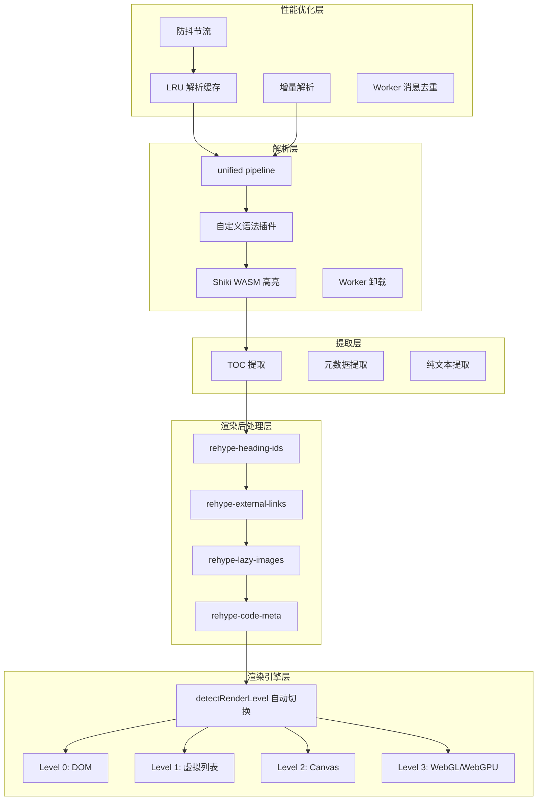
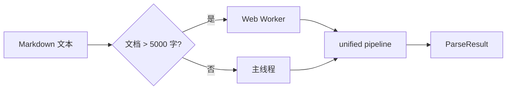
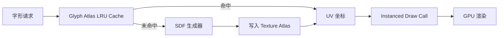
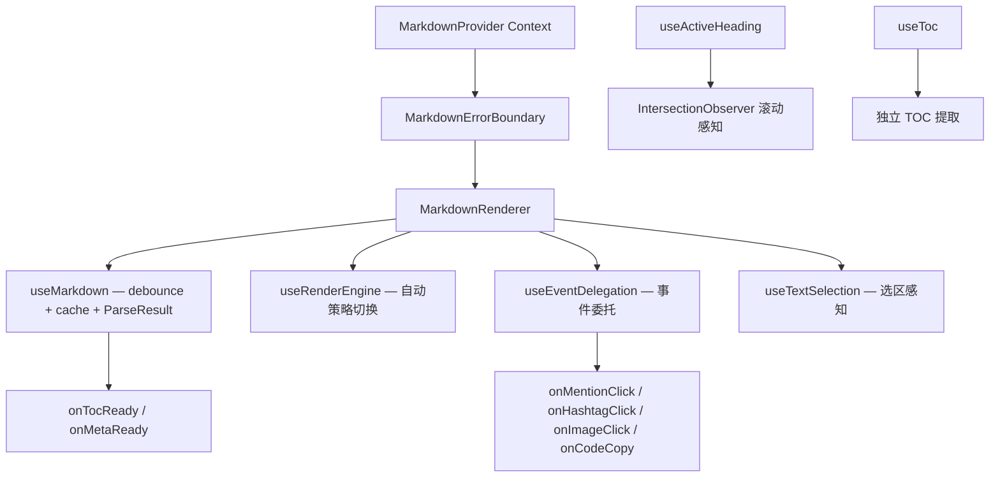
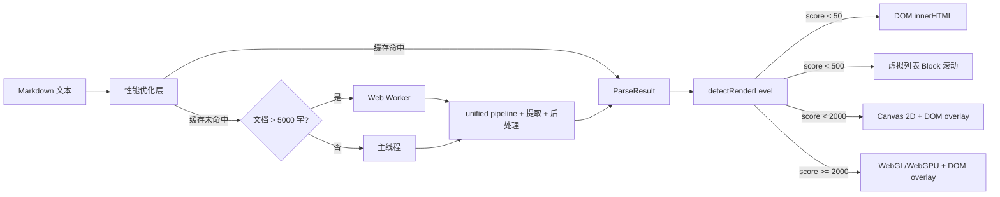

# Markdown Parser 企业级架构设计 — 五层渲染引擎

> 📅 创建日期：2026-04-05
> 📌 作者：luhanxin
> 🏷️ 标签：技术文档 · Markdown · 渲染引擎 · Canvas · WebGL · 性能优化

---

## 1. 问题背景

当前文章 Markdown 渲染使用 `react-markdown` + `remark-gfm`，仅支持基础 Markdown 和 GFM 语法。经 GLM 初版实现后，发现以下严重问题：

### 1.1 架构偏离 Spec

- WASM Worker 架构完全缺失（Spec Decision 2 核心设计）
- Mermaid 渲染错误地放在 React/Vue 各自实现，违背"共享核心逻辑"
- 缺少 `ParseResult` 统一类型，双重解析浪费性能

### 1.2 实现 Bug

- 三个自定义语法插件使用 `className`（JSX 属性名）而非 `class`（HTML 属性名），样式全部失效
- 插件设计冲突：节点被提前转为 HTML，`rehypeCustomNodes()` 成为死代码
- Container 插件只能匹配单段落，多行内容解析失败
- Vue `emit` 返回值误用、`onMounted` 清理方式错误

### 1.3 企业级能力缺失

- 无事件代理、标题锚点、滚动感知、渲染后处理
- 无渲染引擎分级：大文档只有 `dangerouslySetInnerHTML` 一种方式
- 无解析缓存、增量解析、防抖节流

## 2. 五层架构总览

```
┌─────────────────────────────────────────────────────────────┐
│                     性能优化层                                │
│  LRU 解析缓存 · 增量解析 · 防抖节流 · Worker 消息去重         │
├─────────────────────────────────────────────────────────────┤
│                     渲染引擎层                                │
│  Level 0: DOM  │  Level 1: 虚拟列表  │  Level 2: Canvas     │
│                │                     │  Level 3: WebGL/GPU  │
│                    detectRenderLevel 自动切换                 │
├─────────────────────────────────────────────────────────────┤
│                     渲染后处理层                               │
│  heading-ids · external-links · lazy-images · code-meta      │
├─────────────────────────────────────────────────────────────┤
│                     提取层                                    │
│  TOC 提取 · 元数据提取 · 纯文本提取                           │
├─────────────────────────────────────────────────────────────┤
│                     解析层                                    │
│  unified pipeline · 自定义语法插件 · Shiki WASM · Worker     │
└─────────────────────────────────────────────────────────────┘
```

### 架构数据流



## 3. 解析层 — unified pipeline + Worker

### 3.1 统一 ParseResult

消除双重解析（`renderMarkdown` + `parseMarkdownToAst`），一次 unified pipeline 完成所有提取：

```typescript
interface ParseResult {
  /** 渲染后的 HTML */
  html: string;
  /** 目录树 */
  toc: TocItem[];
  /** 文章元数据 */
  meta: ArticleMeta;
  /** 纯文本（搜索索引） */
  plainText: string;
  /** AST block 分块（虚拟列表/Canvas/WebGL 使用） */
  blocks: BlockNode[];
}

interface BlockNode {
  type: 'heading' | 'paragraph' | 'code' | 'table' | 'container'
    | 'list' | 'blockquote' | 'thematicBreak' | 'html' | 'math';
  html: string;
  startLine: number;
  endLine: number;
  estimatedHeight: number;
}
```

### 3.2 插件系统修复

**问题**：remark 插件直接把自定义节点转为 HTML 字符串（且用了 `className`），`rehypeCustomNodes` 成为死代码。

**方案**：

```
remark 插件 ──产出──> 自定义 mdast 节点 (MentionNode/HashtagNode/ContainerNode)
       │
       ▼
remark-rehype  ──handlers──> hast-handlers.ts 统一映射 (使用正确的 class 属性)
       │
       ▼
rehype 阶段 ──标准 hast 元素──> rehype-stringify
```

### 3.3 Worker 架构



- 文档 > 5000 字自动移入 Worker
- Mermaid 始终在 Worker 中渲染
- Shiki WASM 在 Worker 中执行（避免主线程加载 `.wasm` 卡顿）
- `WorkerRequest/WorkerResponse` 消息协议，支持消息去重

```typescript
interface WorkerRequest {
  id: string;
  type: 'parse' | 'mermaid';
  payload: Record<string, unknown>;
}

interface WorkerResponse {
  id: string;
  type: 'parse' | 'mermaid';
  result?: unknown;
  error?: string;
}
```

## 4. 提取层 — 一次 pipeline 完成

在 remark 阶段通过附加插件提取：

| 提取能力 | 实现方式 | 输出 |
|----------|---------|------|
| TOC | 遍历 heading 节点，生成嵌套树 | `TocItem[]` |
| 元数据 | 解析 frontmatter YAML + 统计字数/阅读时间 | `ArticleMeta` |
| 纯文本 | 遍历 text 节点拼接（跳过代码块） | `string` |
| Block 分块 | 按顶层节点分割，每个 block 独立渲染为 HTML | `BlockNode[]` |

## 5. 渲染后处理层 — rehype 插件

四个 rehype 插件在 hast 树上做最终变换：

### 5.1 rehype-heading-ids

给 `<h1>`-`<h6>` 注入：
- `id` 属性（从标题文本生成 slug）
- 锚点链接 `<a class="heading-anchor" href="#slug">#</a>`

使 TOC 页内跳转生效。

### 5.2 rehype-external-links

检测 `<a href="...">` 是否为外链：
- 外链添加 `target="_blank" rel="noopener noreferrer"`
- 添加外链图标 CSS class

### 5.3 rehype-lazy-images

给 `` 添加 `loading="lazy"` 属性。

### 5.4 rehype-code-meta

代码块外层注入 wrapper：

```html
<div class="code-block-wrapper" data-lang="typescript">
  <span class="code-block-lang">typescript</span>
  <button class="code-block-copy" data-code="...">📋</button>
  <pre class="shiki">...</pre>
</div>
```

使 `dangerouslySetInnerHTML` 渲染的代码块也能有复制功能。

## 6. 渲染引擎层 — 四级自动切换

### 6.1 RenderStrategy 接口

```typescript
interface RenderStrategy {
  readonly name: 'dom' | 'virtual-list' | 'canvas' | 'webgl';

  /** 初始挂载 */
  mount(container: HTMLElement, result: ParseResult): void;
  /** 内容更新 */
  update(result: ParseResult): void;
  /** 卸载清理 */
  unmount(): void;
  /** 滚动到指定标题 */
  scrollTo(headingId: string): void;
  /** 获取当前可视 block 范围 */
  getVisibleRange(): { startBlock: number; endBlock: number };
  /** 事件监听 */
  addEventListener(type: string, handler: EventHandler): void;
  removeEventListener(type: string, handler: EventHandler): void;
}
```

### 6.2 复杂度检测与自动切换

```typescript
interface DocumentComplexity {
  charCount: number;
  blockCount: number;
  codeBlockCount: number;
  mermaidCount: number;
  imageCount: number;
  tableCount: number;
}

type RenderLevel = 'dom' | 'virtual-list' | 'canvas' | 'webgl';

function detectRenderLevel(complexity: DocumentComplexity): RenderLevel {
  const score = complexity.charCount / 1000
    + complexity.blockCount * 2
    + complexity.mermaidCount * 50
    + complexity.imageCount * 10
    + complexity.tableCount * 20;

  if (score < 50) return 'dom';
  if (score < 500) return 'virtual-list';
  if (score < 2000) return 'canvas';
  return 'webgl';
}
```

### 6.3 Level 0 — DOM 策略

| 阈值 | < 5000 字, < 20 block |
|------|----------------------|
| 技术 | `innerHTML` / `dangerouslySetInnerHTML` / `v-html` |
| 优势 | 最简单、浏览器原生渲染、完整 CSS 支持 |
| 劣势 | 大文档 DOM 节点数爆炸，重排重绘卡顿 |

直接将 `ParseResult.html` 设置为容器的 innerHTML。

### 6.4 Level 1 — 虚拟列表策略

| 阈值 | 5000-50000 字, 20-200 block |
|------|---------------------------|
| 技术 | AST block 粒度虚拟滚动 + IntersectionObserver |
| 优势 | DOM 节点数恒定（可视区域 + buffer），内存占用低 |
| 劣势 | block 高度预估不完全精确，滚动时可能有微小跳动 |

```
┌──────────────────────────────────┐
│  占位 div (block 0-4, 预估高度)   │  ← 不在可视区
├──────────────────────────────────┤
│  Block 5: <h2> 真实 DOM          │  ← buffer
│  Block 6: <p> 真实 DOM           │
│  Block 7: <pre> 真实 DOM         │  ← 可视区域
│  Block 8: <table> 真实 DOM       │
│  Block 9: <p> 真实 DOM           │  ← buffer
├──────────────────────────────────┤
│  占位 div (block 10-99, 预估高度) │  ← 不在可视区
└──────────────────────────────────┘
```

- 每个 `BlockNode` 独立渲染为 HTML 片段
- IntersectionObserver 监听可视区域
- 可视区域上下各 `bufferSize` 个 block 挂载真实 DOM
- 其余用占位 `<div style="height: {estimatedHeight}px">` 替代
- 滚动时动态回收/创建 block DOM

### 6.5 Level 2 — Canvas 策略

| 阈值 | 50000-200000 字, 200-1000 block |
|------|-------------------------------|
| 技术 | Canvas 2D 文本绘制 + DOM overlay |
| 优势 | 零 DOM 节点（文本全部 Canvas 绘制），极低内存 |
| 劣势 | 需要自实现文本布局引擎，无障碍性需补偿 |

```
┌─────────────────────────────────────┐
│         Canvas 2D 层                 │  ← 文本/代码/标题/列表全部 Canvas 绘制
│  ┌─────────────────────────────┐    │
│  │    DOM Overlay 层            │    │  ← 链接/图片/复制按钮用绝对定位 DOM
│  │    <a>  <button>       │    │
│  └─────────────────────────────┘    │
└─────────────────────────────────────┘
```

核心模块：

| 模块 | 职责 |
|------|------|
| `CanvasTextRenderer` | 文本布局引擎：`measureText` 计算换行点，支持 bold/italic/code 内联样式 |
| `BlockLayout` | 块级布局计算：标题/段落/列表/代码块/表格的纵向排列和间距 |
| `OverlayManager` | DOM overlay 管理：链接/图片/交互元素用绝对定位 DOM 覆盖在 Canvas 上方 |
| `CanvasSelection` | Canvas 选区：自定义 selection range 映射到文本偏移量 |

Canvas 只绘制可视区域 + buffer，滚动时重新绘制。文本布局结果缓存（相同文本+宽度 → 缓存布局）。

### 6.6 Level 3 — WebGL/WebGPU 策略

| 阈值 | > 200000 字或含大量图表/公式 |
|------|--------------------------|
| 技术 | SDF 字体渲染 + instanced draw call + GPU 文本布局 |
| 优势 | GPU 统一绘制，理论上无限文档长度 |
| 劣势 | 实现复杂度最高，需要 SDF 字体生成 pipeline |



核心模块：

| 模块 | 职责 |
|------|------|
| `SDFFont` | SDF（Signed Distance Field）字体渲染器，每个字符一个 quad |
| `GlyphAtlas` | 字形纹理 atlas，LRU 策略管理显存 |
| `WebGLRenderer` | instanced draw call 批量绘制所有字符 |
| `WebGPUAdapter` | WebGPU 优先使用，降级到 WebGL2 |

### 6.7 降级策略

```
WebGPU 不可用 → WebGL2
WebGL2 不可用 → Canvas
Canvas 初始化失败 → 虚拟列表
虚拟列表异常 → DOM
```

## 7. 性能优化层

### 7.1 LRU 解析缓存

```typescript
class ParseCache {
  private cache: LRUCache<string, ParseResult>;

  constructor(capacity = 50) {
    this.cache = new LRUCache(capacity);
  }

  get(content: string, options: RenderOptions): ParseResult | undefined {
    const key = hashContent(content, options);
    return this.cache.get(key);
  }

  set(content: string, options: RenderOptions, result: ParseResult): void {
    const key = hashContent(content, options);
    this.cache.set(key, result);
  }
}
```

- Key: `content + options` 的 xxhash
- Value: `ParseResult`
- 容量: 默认 50 条
- 命中时直接返回，跳过 unified pipeline

### 7.2 增量解析

```
旧文本: line 1 | line 2 | line 3 | line 4 | line 5
新文本: line 1 | line 2 | LINE 3 MODIFIED | line 4 | line 5
                          ↑ 变化区域

diff → block 2 (包含 line 3) 需要重解析
其余 block 复用上次 AST 子树
合并 → 完整 AST → rehype 渲染
```

- 行级 diff（简化 Myers diff 算法）
- 标记变化行所属的 block index
- 只对变化 block 重新 parse + transform
- 其余复用上次 AST 子树
- 最终合并成完整 AST

### 7.3 防抖节流

| 层面 | 策略 | 默认值 |
|------|------|--------|
| 输入防抖 | `useMarkdown` 内置 debounce | 150ms |
| Worker 去重 | 相同 content hash 只发一次请求 | — |
| 渲染节流 | 短时间多次 ParseResult 更新取最后一次 | 16ms (1 frame) |

## 8. 企业级交互能力

### 8.1 事件代理系统

在容器 div 上通过事件委托（单一 click listener）捕获所有交互：

```typescript
interface EventHandlers {
  onMentionClick?: (username: string) => void;
  onHashtagClick?: (tag: string) => void;
  onImageClick?: (src: string, alt: string) => void;
  onLinkClick?: (href: string) => void;
  onCodeCopy?: (code: string, language: string) => void;
  onHeadingClick?: (id: string, level: number) => void;
}
```

根据 `data-*` 属性和 CSS class 分发：

| 选择器 | 回调 |
|--------|------|
| `a.mention[data-username]` | `onMentionClick` |
| `a.hashtag[data-tag]` | `onHashtagClick` |
| `img` | `onImageClick` |
| `a[href]:not(.mention):not(.hashtag)` | `onLinkClick` |
| `button.code-block-copy[data-code]` | `onCodeCopy` |
| `a.heading-anchor` | `onHeadingClick` |

### 8.2 滚动感知

`useActiveHeading` / `useActiveHeading` composable：

- IntersectionObserver 监听所有 `[id]` 标题元素
- 返回当前可视区域内最靠近顶部的标题 `activeId`
- 用于 TOC 侧边栏高亮跟随

### 8.3 只读选区感知

`useTextSelection` / `useTextSelection` composable：

- 监听 `selectionchange` 事件
- 返回选中文本内容
- 可用于「引用回复」「划线评论」等场景

### 8.4 全局 Provider

React Context / Vue provide-inject 提供统一配置：

```typescript
interface MarkdownContextValue {
  /** 主题配置 */
  theme?: { code?: string; highlight?: string };
  /** 组件覆盖映射 */
  components?: {
    mention?: ComponentType<{ username: string }>;
    hashtag?: ComponentType<{ tag: string }>;
    codeBlock?: ComponentType<{ code: string; language: string }>;
    image?: ComponentType<{ src: string; alt: string }>;
  };
  /** 事件回调 */
  eventHandlers?: EventHandlers;
  /** 渲染引擎配置 */
  renderLevel?: RenderLevel | 'auto';
}
```

### 8.5 错误边界

- React: `MarkdownErrorBoundary` class 组件
- Vue: `onErrorCaptured` hook
- Mermaid/Shiki 出错时显示 fallback UI 而非整个组件 crash

## 9. React 组件架构



## 10. 渲染引擎完整数据流



## 11. 目录结构

### 11.1 md-parser-core

```
packages/md-parser-core/src/
├── index.ts                    # 统一导出
├── core/
│   ├── parse.ts                # parseMarkdownToAst
│   ├── render.ts               # renderMarkdown → ParseResult
│   ├── extract-toc.ts          # remark 插件形式提取 TOC
│   ├── extract-text.ts         # 纯文本提取
│   ├── extract-meta.ts         # 元数据提取
│   └── highlight.ts            # Shiki 代码高亮
├── plugins/
│   ├── remark-mention.ts       # @mention → MentionNode
│   ├── remark-hashtag.ts       # #hashtag → HashtagNode
│   ├── remark-container.ts     # :::container → ContainerNode
│   ├── hast-handlers.ts        # 自定义节点 → hast 映射
│   ├── rehype-heading-ids.ts   # 标题锚点注入
│   ├── rehype-external-links.ts# 外链处理
│   ├── rehype-lazy-images.ts   # 图片懒加载
│   └── rehype-code-meta.ts     # 代码块增强
├── types/
│   ├── ast.ts                  # MentionNode / HashtagNode / ContainerNode
│   ├── toc.ts                  # TocItem
│   ├── meta.ts                 # ArticleMeta
│   ├── result.ts               # ParseResult + BlockNode
│   ├── worker.ts               # WorkerRequest / WorkerResponse
│   ├── events.ts               # EventHandlers
│   └── engine.ts               # RenderStrategy / RenderLevel / DocumentComplexity
├── worker/
│   ├── index.ts                # WorkerManager
│   ├── worker-entry.ts         # Worker 线程入口
│   ├── parse-worker.ts         # Worker 内解析
│   └── mermaid-worker.ts       # Worker 内 Mermaid 渲染
├── engine/
│   ├── index.ts                # createRenderEngine 工厂
│   ├── detect.ts               # detectRenderLevel
│   ├── dom-strategy.ts         # Level 0
│   ├── virtual-list-strategy.ts# Level 1
│   ├── canvas/
│   │   ├── index.ts            # Level 2 入口
│   │   ├── text-renderer.ts    # Canvas 文本布局引擎
│   │   ├── block-layout.ts     # 块级元素布局
│   │   ├── overlay-manager.ts  # DOM overlay 管理
│   │   └── selection.ts        # Canvas 选区
│   └── webgl/
│       ├── index.ts            # Level 3 入口
│       ├── sdf-font.ts         # SDF 字体渲染
│       ├── glyph-atlas.ts      # 字形纹理 atlas
│       ├── renderer.ts         # instanced draw call
│       └── webgpu-adapter.ts   # WebGPU 适配 + WebGL2 降级
├── cache/
│   ├── lru-cache.ts            # 通用 LRU 缓存
│   └── parse-cache.ts          # content hash → ParseResult
├── incremental/
│   ├── diff.ts                 # 行级 diff
│   └── incremental-parser.ts   # 增量解析器
└── sanitize/
    └── schema.ts               # XSS 防护 schema
```

### 11.2 md-parser-react

```
packages/md-parser-react/src/
├── index.ts
├── context/
│   └── MarkdownProvider.tsx     # React Context 全局 Provider
├── MarkdownRenderer/
│   ├── index.tsx                # 主渲染组件
│   └── markdownRenderer.module.less
├── components/
│   ├── MarkdownErrorBoundary.tsx
│   ├── CodeBlock/
│   ├── CustomContainer/
│   ├── MermaidDiagram/
│   ├── Mention.tsx
│   └── Hashtag.tsx
├── hooks/
│   ├── useMarkdown.ts           # ParseResult + debounce + cache
│   ├── useToc.ts
│   ├── useActiveHeading.ts      # IntersectionObserver
│   ├── useEventDelegation.ts    # 事件委托
│   ├── useRenderEngine.ts       # 渲染引擎 hook
│   └── useTextSelection.ts      # 只读选区
└── styles/
    └── markdown.module.less
```

### 11.3 md-parser-vue

```
packages/md-parser-vue/src/
├── index.ts
├── context/
│   └── MarkdownProvider.ts      # provide/inject
├── MarkdownRenderer.vue
├── components/
│   ├── CodeBlock.vue
│   ├── CustomContainer.vue
│   ├── MermaidDiagram.vue
│   ├── Mention.vue
│   └── Hashtag.vue
└── composables/
    ├── useMarkdown.ts
    ├── useToc.ts
    ├── useActiveHeading.ts
    ├── useEventDelegation.ts
    ├── useRenderEngine.ts
    └── useTextSelection.ts
```

## 12. 技术选型对比

### 12.1 解析引擎

| 方案 | 优势 | 劣势 | 选择 |
|------|------|------|:----:|
| **unified (remark + rehype)** | 插件生态丰富、AST 标准化、可扩展 | 纯 JS 性能有上限 | ✅ |
| marked | 轻量快速 | 无标准 AST、插件少 | ❌ |
| pulldown-cmark (Rust→WASM) | 解析速度 10-50x | 无 rehype 插件生态 | ❌ 后续 |

### 12.2 代码高亮

| 方案 | 优势 | 劣势 | 选择 |
|------|------|------|:----:|
| **shiki (WASM)** | VS Code 同款引擎、语法精准 | ~500KB WASM | ✅ |
| Prism | 纯 JS、轻量 | 语法精度较低 | ❌ |
| highlight.js | 自动检测语言 | 语法精度较低 | ❌ |

### 12.3 渲染引擎

| 策略 | 适用场景 | 实现复杂度 |
|------|---------|:---------:|
| DOM | 小文档 (< 5K 字) | ⭐ |
| 虚拟列表 | 中等文档 (5K-50K 字) | ⭐⭐ |
| Canvas 2D | 大文档 (50K-200K 字) | ⭐⭐⭐⭐ |
| WebGL/WebGPU | 超大文档 (> 200K 字) | ⭐⭐⭐⭐⭐ |

## 13. 决策总结 (ADR)

| # | 决策 | 选择 | 理由 |
|---|------|------|------|
| 1 | 解析引擎 | unified (remark + rehype) | 插件生态最丰富，AST 标准化 |
| 2 | 代码高亮 | shiki (WASM) | VS Code 同款，语法精准，可移入 Worker |
| 3 | Worker 架构 | Web Worker + 消息协议 | Shiki/Mermaid WASM 在 Worker 执行，不阻塞主线程 |
| 4 | 渲染引擎 | 四级分级自动切换 | 覆盖从小文档到超大文档的全场景 |
| 5 | 插件系统 | mdast 节点 + hast-handlers | 正确的 unified 插件模式，解耦解析与渲染 |
| 6 | 缓存策略 | LRU + content hash | 避免相同内容重复解析 |
| 7 | 增量解析 | 行级 diff + block 粒度重解析 | 内容微小变化时避免全量解析 |
| 8 | 事件处理 | 事件委托 | 单一 listener，零额外 DOM 绑定 |
| 9 | 降级策略 | WebGPU → WebGL2 → Canvas → 虚拟列表 → DOM | 保证所有环境可用 |
| 10 | XSS 防护 | rehype-sanitize | 标准的 hast 树清理，可扩展 schema |

## 14. 参考资料

- [unified 生态文档](https://unifiedjs.com/)
- [shiki 文档](https://shiki.matsu.io/)
- [SDF 字体渲染](https://steamcdn-a.akamaihd.net/apps/valve/2007/SIGGRAPH2007_AlphaTestedMagnification.pdf)
- [WebGPU Spec](https://www.w3.org/TR/webgpu/)
- [Virtual Scrolling 技术](https://web.dev/articles/virtualize-long-lists-react-window)
- [Canvas 文本布局](https://developer.mozilla.org/en-US/docs/Web/API/Canvas_API/Tutorial/Drawing_text)
